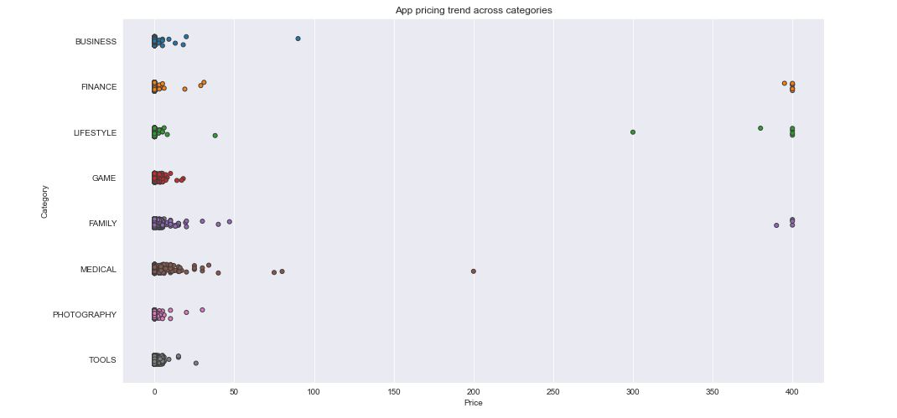

# The Android App Market on Google Play 
Loaded, cleaned, and visualized scraped Google Play Store data to understand the Android app market. 

## Introduction
Mobile apps are everywhere. They are easy to create and can be lucrative. Because of these two factors, more and more apps are being developed. This project is a comprehensive analysis of the Android app market by comparing over ten thousand apps in Google Play across different categories. Insights in the data help to devise strategies to drive growth and retention.

## Data Collection
The data for this project was downloaded from Kaggle(world's largest data science community). The data files are as follows:

**1. googleplaystore.csv :** contains all the details of the applications on Google Play. There are 13 features that describe a given app.

**2. googleplaystore_user_reviews.csv :** contains 100 reviews for each app, most helpful first. The text in each review has been pre-processed and attributed with three new features: Sentiment (Positive, Negative or Neutral), Sentiment Polarity and Sentiment Subjectivity.

## Technology
* Python
## Libraries
* pandas
* numpy
* matplotlib
* plotly
* seaborn

## Topics
* Importing and cleaning data
* Data Manipulation
* Mathematical Calculations
* Data Visualization

## Some Visuals From the project
### Distribution of different apps across different categories

### Sentiment Polarity Distribution

